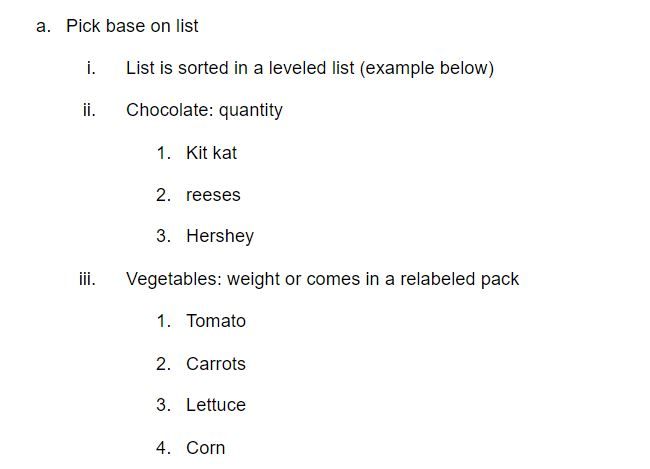

# Assignment 5
### Jeffrey Guan

1. A grocery list consists of items the users want to buy at a grocery store. The application must allow users to add items to a list, delete items from a list, and change the quantity of items in the list (e.g., change from one to two pounds of apples).
    * **Grocery** list consists of **items** the **user** wants to *buy* from the grocery store.
    * Allow users to **add, delete, and change the item of a list (Edit the weight/quantity or item)**
    * This requirement requires me to create a grocery list class which enables the user to add, delete, or change the quantity of an item
------
2. The application must contain a database (DB) of items and corresponding item types.
    * Gets from Database of items and categories 
    * The **application** must contain a **database** which *holds* the name of the **items** and **category** that they’re in
------
3. Users must be able to add items to a list by picking them from a hierarchical list, where the first level is the item type (e.g., cereal), and the second level is the name of the actual item (e.g., shredded wheat). After adding an item, users must be able to specify a quantity for that item.
    * When adding the items, the user is able to **add the items by it’s category**
    * User is able to **add a quantity** after they specify the category
    * Will not affect much of the UML diagram, rather will affect the UI perspective
    * Add a function called **groupItems()** which will display item by catagory 
    * 
------
4. Users must also be able to specify an item by typing its name. In this case, the application must look in its DB for items with similar names and ask the users, for each of them, whether that is the item they intended to add. If a match cannot be found, the application must ask the user to select a type for the item and then save the new item, together with its type, in its DB.
    * Application looks into database for similar names to user input
        * If match is found return the item: Asks the user if they want to add it to list
        * Else the application will ask the user if they want to save the item, along with a quantity
    * There needs to be a way for the user to **add** and get **result from the database** to in both cases of yes and no, the user needs to add an item to list and specify the catagory and quantity.
    * If match cannot be found it will ask the user if they want to *save that one item into the database*
        * either case there will be a write to the database after adding either or item to the DB
------
5. Lists must be saved automatically and immediately after they are modified.
    * List must be updated automatically as soon as they are done adding/deleting/changing
    * After each action the, the list must be saved, since there could be multiple lists it should be saved on the local file rather than the database
    * **Adding, deleting, and changing the quantity** of the item is *directly linked* to the **database**
------
6. Users must be able to check off items in a list (without deleting them)
    * Users must be able to check checkboxes off the list, without delete the items
    * Needs **checkboxes** which will not delete the item which checked
------
7. Users must also be able to clear all the check-off marks in a list at once.
    * **Clear off all checkboxes** at once
        * must also update to DB
    * A *button* for clearing all checked items
        * This will send a call to the database to uncheck all of the current items
------
8. Check-off marks for a list are persistent and must also be saved immediately.
    * Checkmarks are also saved automatically to the DB
------
9. The application must present the items in a list grouped by type, so as to allow users to shop for a specific type of product at once (i.e., without having to go back and forth between aisles).
    * Present the **items** in the list by **category**
    * Presented in a list of items, which are **grouped** by **category**
    * Mostly part of the UI/UX
------
10. The application must support multiple lists at a time (e.g., “weekly grocery list”, “monthly farmer’s market list”). Therefore, the application must provide the users with the ability to create, (re)name, select, and delete lists.
    * Supports multiple lists
        * Therefore users can **create, rename, select, and delete lists**
        * Lists are a object in this instance
            * Ability to have multiple lists
    * Must be able to use **getListDetails()** to get the detail of the list from the **DB**.

------
11. The User Interface (UI) must be intuitive and responsive
    * UI does not affect the effectivity of the program nor the UML diagram